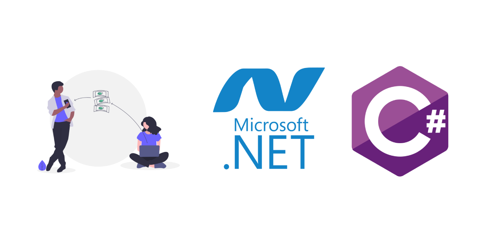



# A Payroll Application with SOLID Principles

A simple Payroll application that calculates an employee's salary, 
I've used some SOLID principles below to make software easy to maintain, scalable:

* Use of the Single Responsibility Principle;
* Use of the Open-Closed Principle;
* Use of the Dependency Inversion Principle;

## TO DO

* Use of the Liskov Substitution Principle;
* Use of the Interface Segregation Principle;

